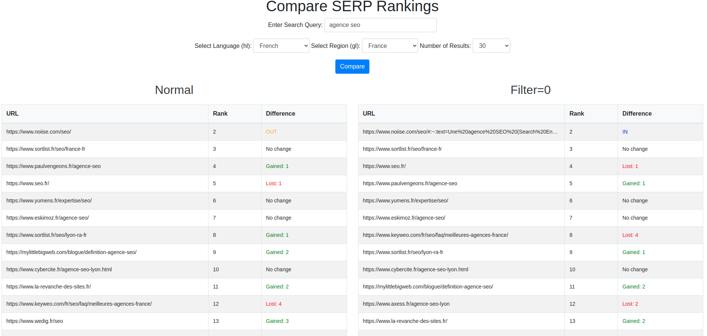

# SERP comparison with “filter=0" (Compare SERP Rankings)

This project allows you to compare SERP results with the most relevant and unfiltered results with similar results.

This would allow you to see urls that cannabilize or see urls that exit the SERP with filters.

You can compare the 2 serps to see who is coming out of the ranking results with or without filters.

## Installation

```bash
pip install -r requirements.txt

# Start the FastAPI server
uvicorn scraper_api:app --reload

# Start the Flask server
python3 app.py
```

## DEMO
